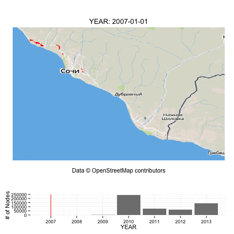

<link href="http://kevinburke.bitbucket.org/markdowncss/markdown.css" rel="stylesheet"></link>
USE OSMTimeLapseR to animate your own data
========================================================

In this example, we will download a dataset from Michal Migurski's amazing [Metro Extracts](http://osm-extracted-metros.s3.amazonaws.com/sochi.osm.pbf) for Sochi, Russia, and visualize data on OSM over time. In this example, we will create a GIF, but you could create an HTML-based visualization with controls without much hassle if you have a look at [the html demo](AnimateHTML.html)

```{r cache=TRUE, output=FALSE, warning=FALSE, message=FALSE}
 ## Load the library
require(OSMTimeLapseR)                   
## Download file into local directory
download.file(url = "http://osm-extracted-metros.s3.amazonaws.com/sochi.osm.pbf",
              destfile='sochi.osm.pbf')  

## Load OSM file for time lapse
sochi_2013 = data_table_from_OSM_file('sochi.osm.pbf')
 
## Create a GIF. Note: requires ImageMagick.
saveGIF({                       
    time_lapse(sochi_2013, 'year', verbose = FALSE)
}, movie.name = "sochi_yearly.gif", interval = 0.5, outdir = getwd())
```


[1] To install OSMTimeLapseR, copy and paste the following into an R console. You will also need to install Java (for the downloading and re-projecting the basemap) and ImageMagick (for creating GIFs).
```install.packages('devtools'); require(devtools); install_github("prabhasp/OSM-TimeLapseR")```
